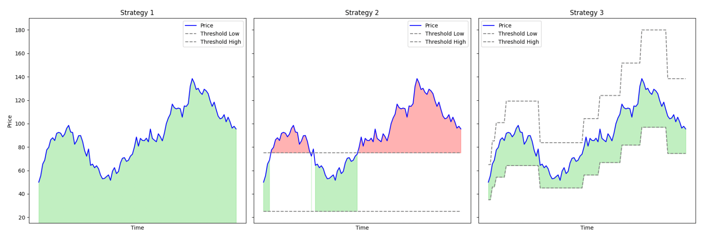

# On-Chain Liquidity Provision Strategies for Airdropped Tokens

This repository includes the code required to backtest the three strategies explored in the internship thesis titled "On-Chain Liquidity Provision Strategies for Airdropped Tokens". The strategies and dataset information are provided below:

## Strategies:

1. **Strategy 1: Provide liquidity to the whole price range**
    - Description: This strategy involves providing liquidity in a price range of 0.01 to 100 times the first price observed in the dataset. It aims to mimic Uniswap v2 liquidity provision strategies.
    - Folder: `/Strategies/Strategy1.py`

2. **Strategy 2: Provide liquidity within ±50% range**
    - Description: This strategy leverages liquidity concentration by defining an upper limit and a lower limit set at 50% of the first price observed in the database.
    - Folder: `/Strategies/Strategy2.py`

3. **Strategy 3: Provide liquidity within ±30% range with rebalancing**
    - Description: In this strategy, the range is set with an upper limit and a lower limit set at 30% from the price. When the current price reaches 10% from either boundary, the position is closed, and a new position is established with a fresh upper limit and lower limit, set at 30% from the new price.
    - Folder: `/Strategies/Strategy3.py`

## Dataset:

The repository also contains a folder named `Data`, which includes the datasets of the four airdrops analyzed: APE, BLUR, PSP, and HOP.

- Folder: `/Data/`

To add additional airdrops, the datasets should have the following structure:

- First column: `time` - the time at which each piece of data was recorded.
- Second column: `price` - the price of the base asset in ETH.
- Third column: `feeGrowth0` - the value of `feeGrowthGlobal0` variable of the liquidity pool being studied.
- Fourth column: `feeGrowth1` - the value of `feeGrowthGlobal1` variable of the liquidity pool being studied. 

## Usage:

To use the code provided in this repository, follow the instructions below:

1. Install the required libraries: `math`, `pandas`, `matplotlib`, and `numpy`. 
2. Run the code: `python main.py`

## Author:

- Florian Majérus (University of Lausanne, HEC)
